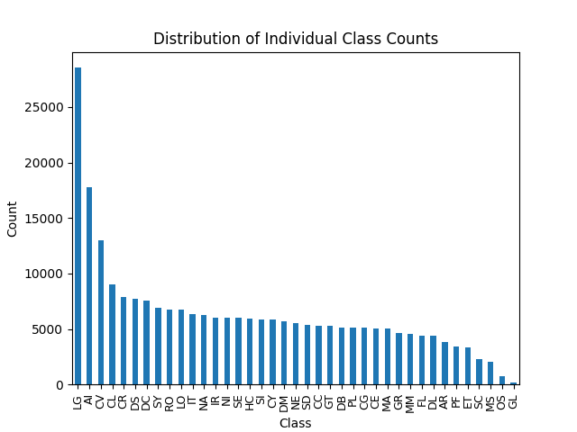

# NLP Research Aggregator
A natural language processing (NLP)-driven web app that aggregates and displays computer science research papers from multiple scholarly sources. A mulit-label text classification model, trained with Keras, tags papers by topic areas. 

The web app features a TypeScript React frontend and Flask backend REST API with MongoDB that supports user authentication and CRUD operations on users and bookmarks.

## Installation

### Prerequisites

- Python [install](https://www.python.org/)
- Node.js and npm [install](https://nodejs.org/)

```bash
# install Flask REST API dependencies
$ cd api && pip install -r requirements.txt

# install NLP model depdendencies
$ cd api/model && pip install -r requirements.txt

# install frontend depdendencies
$ npm install
```

Remove the ```.example``` extension from the ```.env.example``` file and replace the MONGODB_USERNAME, MONGODB_PASSWORD, and JWT_KEY values appropriately.

### Running the Application

Execute the following commands where appropriate:

```bash
# 1. generate training dataset
$ cd api/model && python -m scraper

# 2. train model
$ cd api/model && python -m train

# 3. start database aggregator
$ cd api && python aggregator.py

# 4. start backend server
$ npm run api

# 5. start frontend server
$ npm start
```

### Testing

```bash
# run backend tests
$ cd api/tests && pytest -v

# run frontend tests
$ npm run test
```

## Multi-label Text Classification

Since the application aggregates data from multple scholarly sources, a model was needed to standardise topic area classification. Using Keras, a feedforward neural network was trained on >143K research paper abstracts across 39 classification classes. 

### Dataset Analysis



The plot above illustrates class imbalance amongst the dataset, meaning classes such as LG (machine learning) are over represented. To handle this during model fitting, class weights were computed and then integrated during training.

### Model Architecture

The model is a sequential neural network starting with a text vectorization layer that converts input text into numerical vectors. This is followed by 3 hidden dense layers, each with 150 neurons and the ReLU activation function, which introduces non-linearity to help identify patterns in the text data. Between each of these is a dropout layer with a rate of 0.2 to mitigate overfitting. The final layer has the same number of neurons as the number of classes and uses the sigmoid activation function, which estimates probabilities for each label.

The model is compiled using a binary crossentropy loss function, which measures dissimilarity between predicted probabilities and the true labels. The Adam optimizer determines how the model's weights are updated during training in order to minimize the loss function.

### Training Evaluation


Confusion matrices visualise how many labels were correctly and incorrectly predicted. The above matrix is the aggregated confusion matrix for each class of a test dataset. It shows few false negatives (25) and few false positives (37).