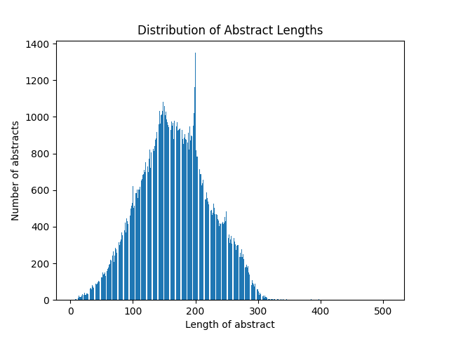
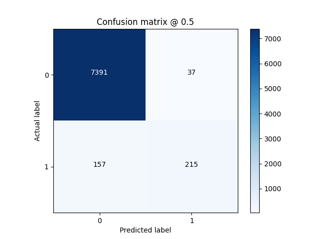

# NLP Research Aggregator
A natural language processing (NLP)-driven web app that aggregates and displays computer science research papers from multiple scholarly sources. A mulit-label text classification model, trained with Keras, tags papers by topic areas. 

The web app features a TypeScript React frontend and Flask backend REST API with MongoDB that supports user authentication and CRUD operations on users and bookmarks.


## Installation

### Prerequisites

- Python
- Node.js and npm

```bash
# install backend dependencies
$ cd api && pip install -r requirements.txt

# install model depdendencies
$ cd api/model && pip install -r requirements.txt

# install frontend depdendencies
$ npm install
```

In the ```/api``` directory, remove the ```.example``` extension from the ```.env.example``` file and replace the variable values.

### Running the Application

```bash
# generate training dataset
$ cd api && python -m model.scraper

# train model
$ cd api && python -m model.train

# aggregate database papers
$ cd api && python aggregator.py

# start backend server
$ npm run api

# start frontend server
$ npm start
```

### Testing

```bash
# run backend tests
$ cd api/tests && pytest -v --cov

# run frontend tests
$ npm run test
```

## Multi-label Text Classification

The application aggregates data from multiple scholarly sources, so a model was needed to standardize topic area classification. Using Keras, a neural network was trained on 141k research paper abstracts across 38 classes. Unseen abstracts can be passed into the model, and each will have one or more topic area labels predicted.

### Dataset Analysis

The training dataset was generated and compressed by the multi-threaded ```scraper.py``` program, which aggregates research paper abstracts and their respective topic area labels using the arXiv.org API.


The plot above shows class imbalance in the dataset, meaning classes such as LG (machine learning) are overrepresented. To handle this, class weights were computed using each classes' frequency, and those with high instances receive low weights, which reduce significance during training.



The plot above shows that the distribution of abstract lengths closley follow a normal distribution, indicating a realistic representation. During vectorization, abstracts are converted to integer vectors of a fixed size, where those abstracts with lengths less than this size are padded and those larger are partially limited.

### Model Architecture

Text is first normalized by converting it to lowercase and removing new line characters, URLs, Latex, non-alphabetic characters, stop words, short words (sub 3 characters) and extra spaces. Text is then converted to an integer vector of a fixed size. It's first tokenized into distinct terms, and a mapping is applied to each token to find its index in the vectorizer's vocabulary. Each integer in the resulting vector represents a token in the vocabulary.

An embedding layer is the first layer of the neural network. This takes the integer-encoded vectors and maps each token to a dense vector representation of a fixed size, where the values are learned during training based on context. The embedding vectors capture the semantic relationships between words. Following this is a dropout layer to reduce overfitting by randomly setting a fraction of its input units to zero.

A GlobalAvergagePooling1D layer acts as a dimensionality reduction technique. It takes the sequence of embedded vectors and condenses it into a single vector by averaging the values. This is followed by another dropout layer.

A dense layer of 100 units with a ReLU activation function is used next. ReLU sets negative values to zero and keeps positive values unchanged. This introduces non-linearity to the model, allowing it to learn complex relationships in the data. Afterwards there is another dropout layer.

Finally, a dense layer with a sigmoid activation function and the same number of units as there are classes is used. This function calculates a probability value for each class indepdently, producing a probability distribution.

### Model Evaluation

The dataset was split into 75% training, 12.5% validation and 12.5% test data. A validation dataset is used during model training to optimize hyperparameters, and a test dataset is used post-training to measure performance on unseen data.

The following metrics were monitored during training:
- **Binary Accuracy:** percentage of correctly predicted labels.
- **Precision:** percentage of true positive predictions out of all positive predictions.
- **Recall:** percentage of true positive predictions out of all actual positive instances in the dataset.
- **Macro F1 Score:** unweighted average of the harmonic mean of precision and recall calculated for each class.

### Binary Accuracy


The graph above shows a high binary accuracy for both the training and validation datasets. However, given that the dataset is imbalanced and multi-label, binary accuracy is not a suitable metric for performance and is misleading.

### Macro F1 Score

F1 score is considered a better metric than binary accuracy for imbalanced multi-label data. It's more comprehensive and balanced, taking into into account both precision (ability to avoid false positives) and recall (ability to avoid false negatives), which are calculated for each class individually.


The graph above shows that both the training and validation F1 score's are increasing as the number of epochs increases, indicating little overfitting, both roughly around 70% after 10 epochs.

### Test Dataset Performance

- Binary Accuracy: 98%
- Precision: 83%
- Recall: 59%
- Macro F1 Score: 70%



The confusion matrix above is formatted as follows:

[True Negatives (TN), False Positives (FP)]  
[False Negatives (FN), True Positives (TP)]

A confusion matrix represents a model's performance on unseen data. It visualizes how many labels were correctly and incorrectly predicted. The above plot is the aggregated confusion matrix computed for each class. It uses a threshold of 0.5 on the probability distribution. There are more TP than FP and more TN than FN, indicating accurate positive and negative classification.